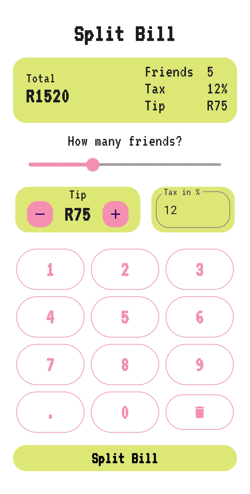

# BillSplitApp

A simple and intuitive bill splitting application built with Flutter. Split expenses quickly and fairly with your friends.

---

## ✨ Features

- Add participants and expenses
- Automatically calculate who owes what
- Clean and minimal UI
- Instant results view

---

## 📱 Screenshots
| Main Screen | Results Screen |
|--------------|---------------|
|  |  |

### Results Screen


---

## 🚀 Getting Started

### Prerequisites

- Flutter installed (https://flutter.dev/docs/get-started/install)

### Run the app

```bash
flutter pub get
flutter run
```

## 🛠️ Tech Stack
- Flutter
- Dart

## 📄 License
This project is open source. Feel free to use or contribute!

